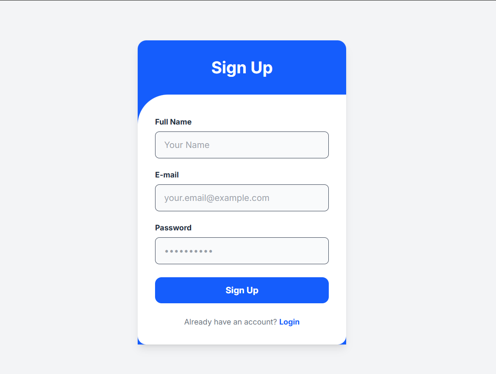

🎓 https://students-five-mauve.vercel.app/

This is the Frontend of the Student Management System built with Next.js (App Router), Tailwind CSS, TypeScript, and NextAuth. It supports both admin and student users, providing full authentication and role-based dashboards


🚀 Features
🔐 Authentication with JWT using NextAuth (credentials provider)
📚 Student Dashboard with profile editing and course info
🧑‍💼 Admin Dashboard with statistics and student management
🔄 Role-based access (Admin vs. Student)
🌈 Responsive UI with Tailwind CSS
📦 Mocked backend support for development


AND ADMIN  DASHBOARD


🏗️ Tech Stack
  Tech	          Description
. Next.js	: React framework for SSR and routing
. TypeScript :	Static type checking
. Tailwind CSS: 	Utility-first CSS framework
 .NextAuth.js: 	Authentication with JWT
 .Axios	 : HTTP client
 .Lucide-react	: Icons
 .React Hot Toast	: Toast notification system

📂 Project Structure


├── backend/                # Node.js, Express, MongoDB Backend
│   ├── controllers/
│   ├── models/
│   ├── routes/
│   ├── .env                # Local backend environment variables (not in git)
│   ├── index.js
│   └── package.json
│
├── frontend/               # Next.js Frontend
│   ├── app/
│   ├── public/
│   ├── .env.local          # Local frontend environment variables (not in git)
│   └── package.json
│
├── .gitignore              # Specifies files for Git to ignore
└── README.md               # You are here!

📦 Installation & Usage

1. Clone the repository
git clone <your-repository-url>
cd <your-repository-name>

##Set up the Backend:
# Navigate into the backend directory
cd backend

# Install dependencies
npm install

# Create a local environment file
# (Copy the contents from .env.example if you have one, or create a new file)
touch .env

# Add your environment variables to the .env file
# See the "Environment Variables" section below for details

## Set up the Frontend: 
 # From the root directory, navigate into the frontend directory
cd ../frontend

# Install dependencies
npm install

# Create a local environment file for the frontend
touch .env.local

# Add the local backend URL to the .env.local file
# This is critical for local development
echo "NEXT_PUBLIC_API_URL=http://localhost:5000" > .env.local


2. Install dependencies
npm install
3. Create your environment file
NEXTAUTH_SECRET=your-secret
NEXTAUTH_URL=http://localhost:3000
NEXT_PUBLIC_BACKEND_URL=http://localhost:5000

4. Run the development server
npm run dev

🧑‍💻 Login Credentials (Mocked Users)

- Admin
Email: umuhiregermaine125@gmail.com
Password: kigali2025

-Student
Email: kanyeprince05@gmail.com
Password: kigali2025
&&
Email:hirwabertrand11@gmail.com
Password: kigali2025

Or register a new account as a student.




This is a [Next.js](https://nextjs.org) project bootstrapped with [`create-next-app`](https://nextjs.org/docs/app/api-reference/cli/create-next-app).

## Getting Started

First, run the development server:

```bash
npm run dev

