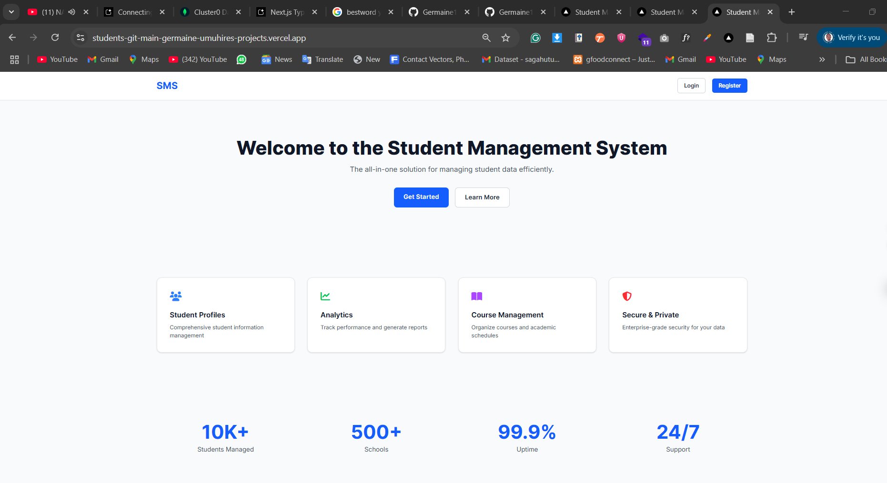
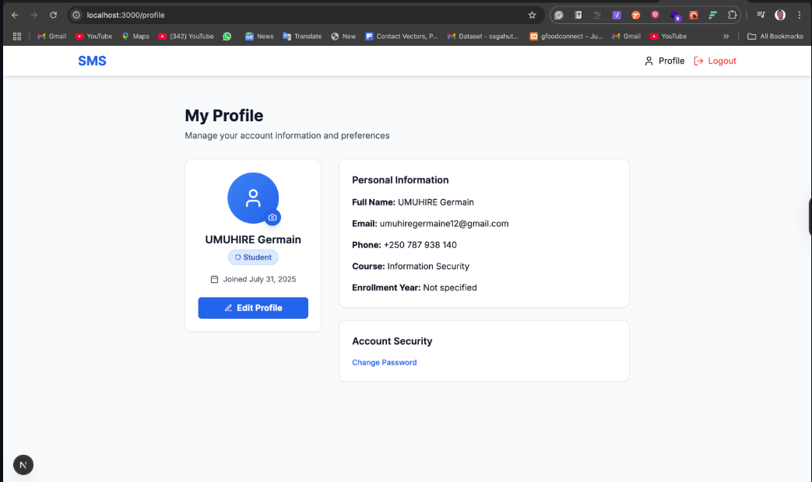
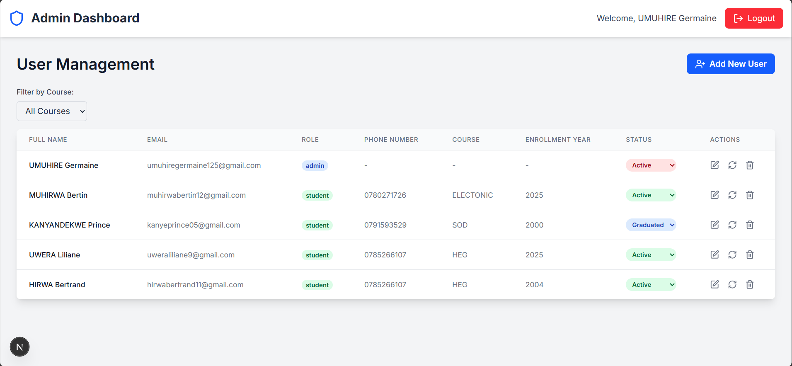

🎓 https://students-git-main-germaine-umuhires-projects.vercel.app/

This is the Frontend of the Student Management System built with Next.js (App Router), Tailwind CSS, TypeScript, and NextAuth. It supports both admin and student users, providing full authentication and role-based dashboards




🚀 Features
🔐 Authentication with JWT using NextAuth (credentials provider)
📚 Student Dashboard with profile editing and course info
🧑‍💼 Admin Dashboard with statistics and student management
🔄 Role-based access (Admin vs. Student)
🌈 Responsive UI with Tailwind CSS
📦 Mocked backend support for development



AND ADMIN  DASHBOARD


🏗️ Tech Stack
Tech	Description
Next.js	React framework for SSR and routing
TypeScript	Static type checking
Tailwind CSS	Utility-first CSS framework
NextAuth.js	Authentication with JWT
Axios	HTTP client
Lucide-react	Icons
React Hot Toast	Toast notification system

📦 Installation & Usage
1. Clone the repository
git clone https://github.com/Germaine144/students.git
cd students
2. Install dependencies
npm install
3. Create your environment file
NEXTAUTH_SECRET=your-secret
NEXTAUTH_URL=http://localhost:3000
NEXT_PUBLIC_BACKEND_URL=http://localhost:5000
4. Run the development server
npm run dev


This is a [Next.js](https://nextjs.org) project bootstrapped with [`create-next-app`](https://nextjs.org/docs/app/api-reference/cli/create-next-app).

## Getting Started

First, run the development server:

```bash
npm run dev
# or
yarn dev
# or
pnpm dev
# or
bun dev
