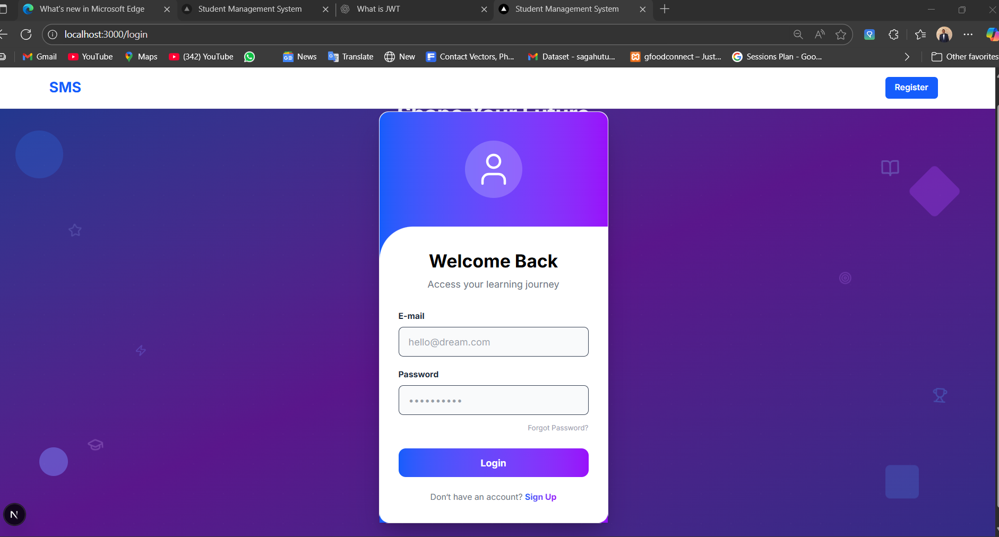

🎓 https://students-five-mauve.vercel.app/

This is the Frontend of the Student Management System built with Next.js (App Router), Tailwind CSS, TypeScript, and NextAuth. It supports both admin and student users, providing full authentication and role-based dashboards


## 🚀 Features

- 🔐 **Authentication** with JWT using NextAuth (credentials provider)
- 📚 **Student Dashboard** with profile editing and course info
- 🧑‍💼 **Admin Dashboard** with statistics and student management
- 🔄 **Role-based access** (Admin vs. Student)
- 🌈 Responsive UI with Tailwind CSS
- 📦 Mocked backend support for development


AND ADMIN  DASHBOARD


## 🏗️ Tech Stack

| Tech               | Description                          |
|--------------------|--------------------------------------|
| Next.js            | React framework for SSR and routing  |
| TypeScript         | Static type checking                 |
| Tailwind CSS       | Utility-first CSS framework          |
| NextAuth.js        | Authentication with JWT              |
| Axios              | HTTP client                          |
| Lucide-react       | Icons                                |
| React Hot Toast    | Toast notification system            |

📂 Project Structure


├── backend/                # Node.js, Express, MongoDB Backend
│   ├── controllers/
│   ├── models/
│   ├── routes/
│   ├── .env                # Local backend environment variables (not in git)
│   ├── index.js
│   └── package.json
│
├── frontend/               # Next.js Frontend
│   ├── app/
│   ├── public/
│   ├── .env.local          # Local frontend environment variables (not in git)
│   └── package.json
│
├── .gitignore              # Specifies files for Git to ignore
└── README.md               # You are here!

📦 Installation & Usage

1. Clone the repository
git clone <your-repository-url>
cd <your-repository-name>

##Set up the Backend:
# Navigate into the backend directory
cd backend

# Install dependencies
npm install

# Create a local environment file
# (Copy the contents from .env.example if you have one, or create a new file)
touch .env

# Add your environment variables to the .env file
# See the "Environment Variables" section below for details

## Set up the Frontend: 
 # From the root directory, navigate into the frontend directory
cd ../frontend

# Install dependencies
npm install

# Create a local environment file for the frontend
touch .env.local

# Add the local backend URL to the .env.local file
# This is critical for local development
echo "NEXT_PUBLIC_API_URL=http://localhost:5000" > .env.local


2. Install dependencies
npm install
3. Create your environment file
NEXTAUTH_SECRET=your-secret
NEXTAUTH_URL=http://localhost:3000
NEXT_PUBLIC_BACKEND_URL=http://localhost:5000

4. Run the development server
npm run dev

🧑‍💻 Login Credentials (Mocked Users)

- Admin
Email: umuhiregermaine125@gmail.com
Password: kigali2025

-Student
Email: kanyeprince05@gmail.com
Password: kigali2025
&&
Email:hirwabertrand11@gmail.com
Password: kigali2025

Or register a new account as a student.


and Login Form 




## 📬 API Endpoints Used
This frontend expects the following endpoints from the backend:

# 📬 API Endpoints Used

| Method | Endpoint              | Description                   |
|--------|-----------------------|-------------------------------|
| POST   | /api/auth/register    | Register a new user           |
| POST   | /api/auth/login       | Login and return JWT          |
| GET    | /api/auth/me          | Get current user profile      |
| PUT    | /api/users/me         | Update current user profile   |
| GET    | /api/students         | List students (admin only)    |
| POST   | /api/students         | Add new student (admin only)  |
| PUT    | /api/students/:id     | Update a student (admin only) |
| DELETE | /api/students/:id     | Delete a student (admin only) |
| PATCH  | /api/users/:id/role   | Change user role (admin only) |


## 📄 License
MIT License. See LICENSE for details.

--

## 🙋‍♂️ Author
UMUHIRE Germaine

### Email: umuhiregermaine12@gmail.com

--

# 🛠️ Student Management System – Backend

Backend server for the Student Management System using Node.js, Express, and MongoDB.

\--

## 📆 Features

* JWT authentication and role-based authorization
* CRUD for student records (admin only)
* Profile editing for logged-in users
* API routes for login, registration, and user management
* Seed script to insert initial admin and student data

\--

## 📆 Technologies Used

* Node.js
* Express.js
* MongoDB & Mongoose
* JWT for auth
* Bcrypt for password hashing
* dotenv for environment config
* Helmet, CORS, Rate Limit for security

\--

## 📁 Folder Structure

* `controllers/` – Auth, user, student logic
* `models/` – Mongoose schemas
* `routes/` – Express route handlers
* `middlewares/` – Error and auth handlers
* `config/` – DB connection
* `seeder/` – Initial data script
* `server.js` – App entry point

\--

## 📅 Setup Instructions

### - 1. Clone the repository

```bash
git clone https://github.com/your-username/student-management-system-backend.git
cd student-management-system-backend
```

### - 2. Install dependencies

```bash
npm install
```

### - 3. Create an environment file

Create a `.env` file in the root directory and add:

```
PORT=5001
NODE_ENV=development

# MongoDB
MONGO_URI=your-mongodb-uri

# JWT
JWT_SECRET=superSecretStudentSystem2025
JWT_EXPIRES_IN=7d
JWT_COOKIE_EXPIRES_IN=7d

# Admin Secret
ADMIN_SECRET=secret2025

# CORS
NEXT_PUBLIC_API_URL=http://localhost:5000
```

\--

## ▶️ Running the Server

```bash
npm run dev
```

Go to: [http://localhost:5001](http://localhost:5001)

\--

## 🌐 API Endpoints

```
Method   | Endpoint               | Description
-------- | ---------------------- | --------------------------------------------
POST     | /api/auth/register     | Register new user (admin/student)
POST     | /api/auth/login        | Login with credentials
GET      | /api/auth/me           | Get current user profile (auth)
PUT      | /api/users/me          | Update logged-in user's profile
PATCH    | /api/users/:id/role    | Change user role (admin only)
GET      | /api/students          | Get paginated students (admin only)
POST     | /api/students          | Create a student (admin only)
GET      | /api/students/:id      | Get single student (admin only)
PUT      | /api/students/:id      | Update student info (admin only)
DELETE   | /api/students/:id      | Delete student (admin only)
GET      | /health                | Health check
```

\--

## 🔐 Authentication & Authorization

* JWT-based authentication using `Authorization: Bearer <token>`
* Role-based access: `admin` and `student`
* To register an admin, include this header:

```
x-admin-secret: secret2025
```

\--

## 🧩️ Seed Data Script

To populate the database with initial users and students:

```bash
node backend/seeder/index.js
```

This will:

* Create 1 admin and 2 student users
* Create 2 student records

Login credentials:

```
Email: admin@example.com
Password: Password@123
```

\--

## 📄 License

MIT License. See LICENSE file.

\--

## ✍️ Author

* UMUHIRE Germaine
* Email: [umuhiregerard12@gmail.com](mailto:umuhiregerard12@gmail.com)


This is a [Next.js](https://nextjs.org) project bootstrapped with [`create-next-app`](https://nextjs.org/docs/app/api-reference/cli/create-next-app).

## Getting Started

First, run the development server:

```bash
npm run dev

